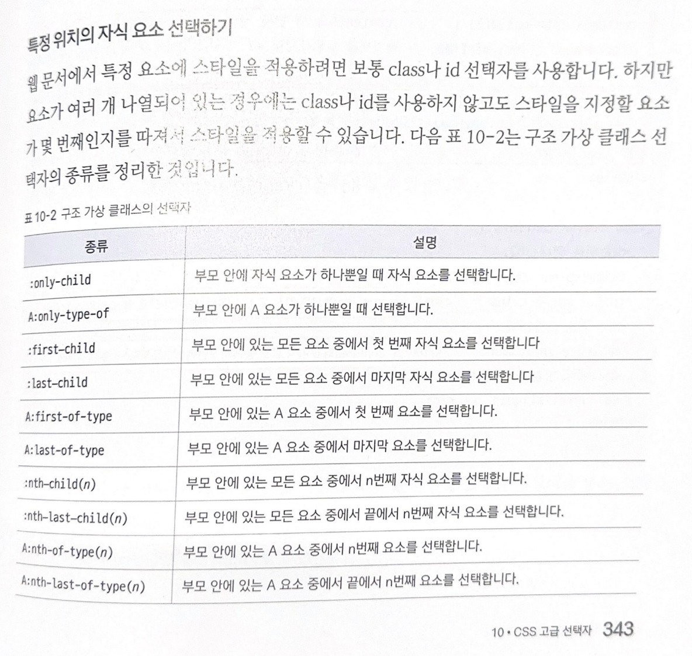
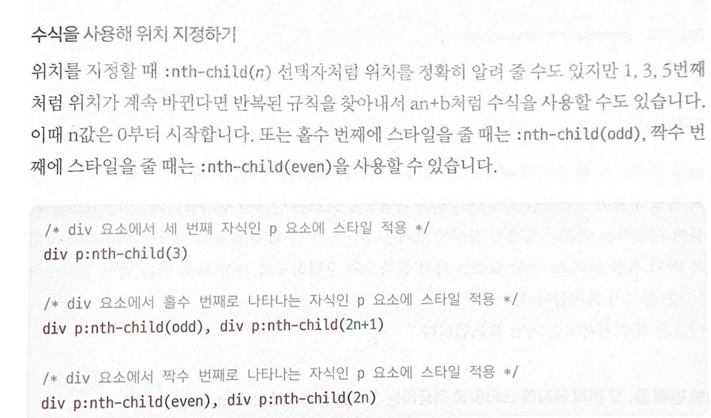

# 연결 선택자
하위 요소에 스타일을 적용하는 하위 선택자와 자식 선택자

## 1. 하위 선택자
부모 요소에 포함된 하위 요소를 모두 선택하며 '자손 선택자' 라고도 한다. 즉, 자식 요소뿐만 아니라 손자 요소, 손자의 손자 요소 등 모든 하위 요소까지 적용된다.

`상위요소 하위요소`

## 2. 자식 선택자
하위 선택자와 다르게 자식 요소에만! 스타일을 적용하는 선택자

`부모요소 > 자식요소`

 

## * 형제 요소에 스타일을 적용하는 인접 형제 선택자와 형제 선택자
웹 문서에서 부모 요소가 같을 경우 형제 관계라고 하고, 형제 관계인 요소에서 먼저 나오는 요소를 형 요소, 나중에 나오는 요소를 동생 요소라고 한다.

## 1. 인접 형제 선택자
형제 요소 중에서 첫 번째 동생 요소만 선택하는 것

`요소1 + 요소 2`

예를 들어 h1 + p { 스타일 내용 } 이면 h1 요소와 형제인 p 요소 중 첫 번째 p 요소만 선택하여 적용한다.

## 2. 형제 선택자
인접 형제 선택자와 달리 모든 형제 요소에 적용된다.

`요소1 ~ 요소2`

예를 들어 h1 ~ p { 스타일 내용 } 이면 h1 요소와 형제인 모든 p 요소에 적용한다.

  

# 속성 선택자

속성값에 따라 원하는 요소를 선택하는 것

  

# 가상 클래스와 가상 요소
### 사용자 동작에 반응하는 가상 클래스

#### 1. `:link 가상 클래스 선택자`
- 방문하지 않은 링크에 스타일을 적용한다. 텍스트 링크는 기본적으로 파란색 글자와 밑줄로 표시되는데, 이 때 링크의 밑줄을 없애거나 색상을 바꾸려면 :link 선택자를 사용한다.

#### 2. `:visited 가상 클래스 선택자`
- 방문한 링크에 스타일을 적용한다. 한 번 이상 방문한 텍스트 링크는 보라색이 기본값으로, 사용자가 방문한 텍스트 링크와 색상이 달라지지 않게 하려면 :visited 선택자를 사용한다.

#### 3. `:hover 가상 클래스 선택자`
- 특정 요소에 마우스 포인터를 올려놓으면 스타일을 적용한다. 

#### 4. `:active 가상 클래스 선택자`
- 웹 요소를 활성화했을 때 스타일을 적용한다. 즉, 웹 요소를 클릭했을 때 스타일을 지정함.

#### 5. `:focus 가상 클래스 선택자`
- 웹 요소에 초점이 맞추어졌을 때 스타일을 적용한다. 예를 들어 텍스트 필드 안에 마우스 포인터를 올려놓거나 웹 문서에서 탭 키를 눌러 입력 커서를 이동했을 때의 스타일을 지정.

 

### 사용자 동작에 반응하는 가상 클래스

#### 1. `:target 가상 클래스 선택자`
- 앵커 대상에 스타일을 적용한다.

#### 2. `:enabled 와 :disabled 가상 클래스 선택자`
- `:enabled`  해당 요소가 사용할 수 있는 상태일 때 스타일을 지정할 때 사용
- `:disabled` 해당 요소가 사용할 수 없는 상태일 때 스타일을 지정할 때 사용

#### 3. `:checked 가상 클래스 선택자`
- 선택한 항목의 스타일을 적용한다. 

#### 4. `:not 가상 클래스 선택자`
- 특정 요소를 제외하고 스타일을 적용한다.

 

### 구조 가상 클래스
#### 1. 특정 위치의 자식 요소 선택하기

 

#### 2. 수식을 사용해 위치 지정하기

 

### 가상 요소
`::first-line 요소, ::first-letter 요소`
- 지정한 요소의 첫 번째 줄이나 첫 번째 글자에 스타일을 적용할 수 있다.
특 ) 무조건 첫 번째 줄에 있어야 적용 가능 !

 

`::before 요소, ::after 요소`
- 지정한 요소의 내용 앞뒤에 스타일을 넣을 수 있다. 이 요소를 사용하면 요소의 앞뒤에 텍스트나 이미지 등을 추가할 수 있다.